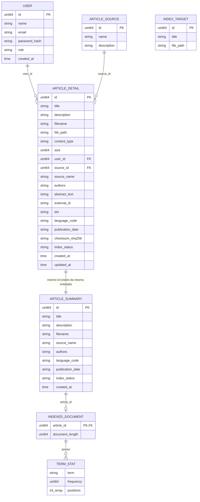

# Modelo Relacional

Modelo derivado exclusivamente das structs Go em `user.go`, `indexing.go` e `article.go`.

---

## 1. Entidades e Atributos

### `User`
| Atributo | Tipo | Observação |
|---|---|---|
| id (PK) | uint64 | |
| name | string | |
| email | string | |
| password_hash | string | não exposto em JSON (`json:"-"`) |
| role | string | valores possíveis: `PESQUISADOR`, `CURADOR` |
| created_at | time.Time | |

> `RegisterInput` (name, email, password) é um DTO de entrada de cadastro, não uma entidade persistida.

---

### `ArticleSource`
| Atributo | Tipo | Observação |
|---|---|---|
| id (PK) | uint64 | |
| name | string | |
| description | string | |

---

### `ArticleSummary`
| Atributo | Tipo | Observação |
|---|---|---|
| id (PK) | uint64 | |
| title | string | |
| description | string | |
| filename | string | |
| source_name | string | dado desnormalizado (sem FK explícita na struct) |
| authors | string | |
| language_code | string | |
| publication_date | string | |
| index_status | string | |
| created_at | time.Time | |

### `ArticleDetail`
| Atributo | Tipo | Observação |
|---|---|---|
| id (PK) | uint64 | |
| title | string | |
| description | string | |
| filename | string | |
| file_path | string | |
| content_type | string | |
| size | uint64 | |
| user_id (FK → User.id) | uint64 | |
| source_id (FK → ArticleSource.id) | uint64 | |
| source_name | string | dado desnormalizado de `ArticleSource.name` |
| authors | string | |
| abstract_text | string | |
| external_id | string | |
| doi | string | |
| language_code | string | |
| publication_date | string | |
| checksum_sha256 | string | |
| index_status | string | |
| created_at | time.Time | |
| updated_at | time.Time | |

---

### `IndexTarget`
| Atributo | Tipo | Observação |
|---|---|---|
| id (PK) | uint64 | |
| title | string | |
| file_path | string | |

---

### `IndexedDocument`
| Atributo | Tipo | Observação |
|---|---|---|
| article_id (PK, FK → Article.id) | uint64 | |
| document_length | uint64 | |
| terms | []TermStat | relação 1:N com `TermStat` |

---

### `TermStat` (entidade fraca de `IndexedDocument`)
| Atributo | Tipo | Observação |
|---|---|---|
| term | string | |
| frequency | uint64 | |
| positions | []int | lista de posições do termo no documento |

---

## 2. DTOs / Views (não são entidades persistidas)

Essas structs combinam dados de outras entidades ou representam parâmetros/relatórios de operações, sem atributos próprios de identidade persistente:

- **`SearchResult`**: view combinando dados de `Article` (id, title, description, filename, source_name, authors, language_code, publication_date, index_status) com `score` e `matched_terms` calculados na busca.
- **`SearchFilters`**: parâmetros de filtro de busca (source, author, language, date_from, date_to, fuzzy, limit).
- **`IndexingReport`**: relatório de execução de indexação (workers, total, indexed, failed, duration_ms, reindexed_all, errors).
- **`IndexingOverview`**: agregação de status de indexação (pending, processing, indexed, errors, terms, occurrences, documents).
- **`BenchmarkResult`** / **`BenchmarkReport`**: métricas de desempenho de indexação.
- **`CollectionStats`**: agregação de estatísticas do acervo (total_articles, pending_articles, indexed_articles, total_authors, total_sources).

---

## 3. Relacionamentos

**Cardinalidades:**
- `User (1) — (N) ArticleDetail`: um usuário pode cadastrar vários artigos (`ArticleDetail.user_id`).
- `ArticleSource (1) — (N) ArticleDetail`: uma fonte pode ter vários artigos (`ArticleDetail.source_id`).
- `ArticleDetail (1) — (1) ArticleSummary`: compartilham o mesmo `id`, representando duas visões (completa e resumida) da mesma entidade artigo.
- `ArticleSummary/ArticleDetail (1) — (0..1) IndexedDocument`: um artigo pode ter um documento indexado (`IndexedDocument.article_id` referencia o `id` compartilhado por ambas as visões).
- `IndexedDocument (1) — (N) TermStat`: um documento indexado possui vários termos com suas estatísticas.
- `IndexTarget`: não possui chave estrangeira explícita nas structs fornecidas, sua estrutura (id, title, file_path) espelha um subconjunto dos campos de artigo, mas nenhuma referência formal (FK) é declarada no código.
