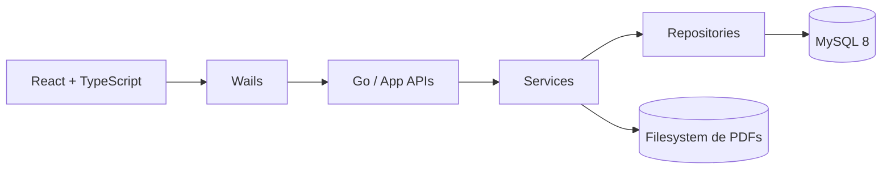
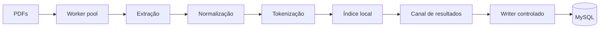
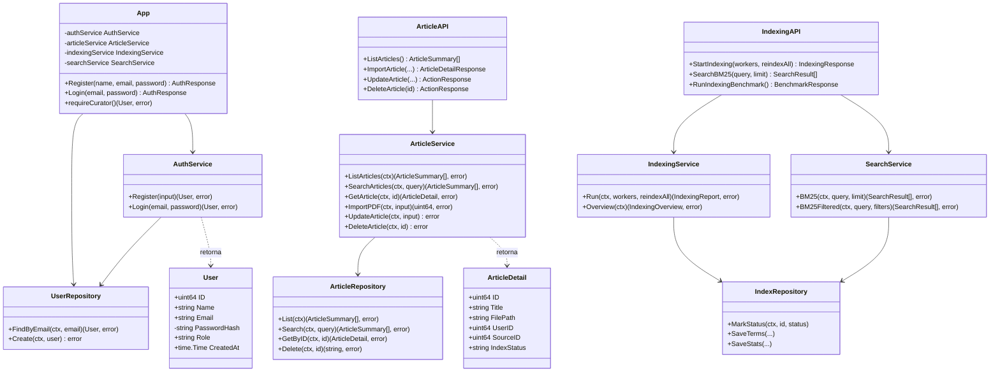
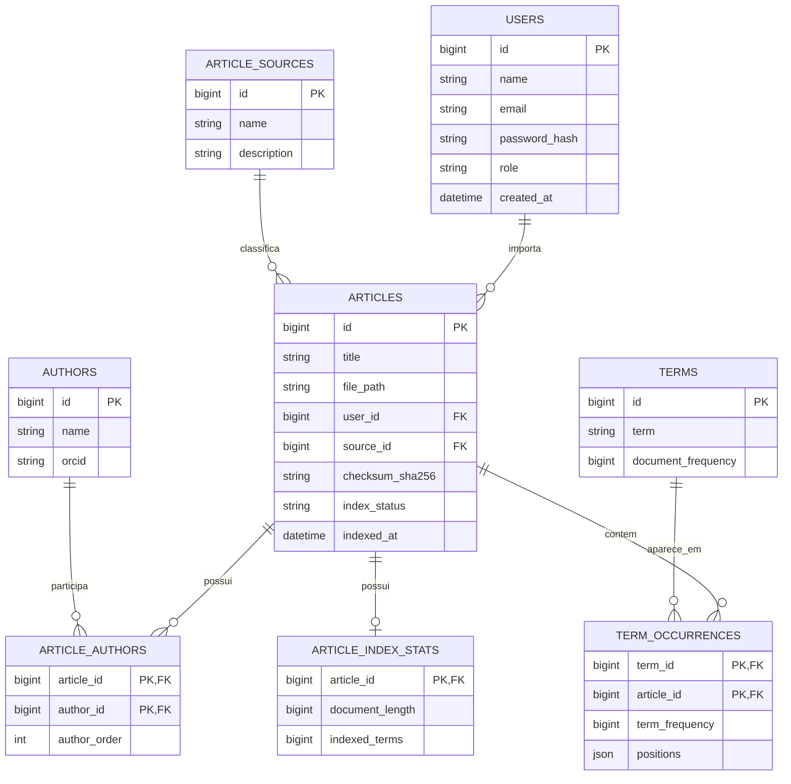

# Sprint 2 — Concordia

## 1. Identificação da equipe

- **Integrantes:**
    - Maria Karolina Rodrigues de Andrade
    - Pedro Felipe Oliveira Tavares
    - Pedro Oliveira Barros Batista de Lima
    - Tomaz Arlindo Silva Ribeiro
    - Vladison Lucas Costa Dos Santos
- **Turma:** CC-8-MB
- **Nome do projeto:** Concordia

## 2. Arquitetura do sistema

**Camadas:**
- **Frontend:** interface, formulários, busca, filtros e métricas.
- **Wails:** ponte entre frontend e Go (bindings expostos em `app.go`, `article_api.go` e `indexing_api.go`).
- **APIs Go:** autenticação, artigos, indexação e benchmark.
- **Services:** regras de negócio (`auth_service.go`, `article_service.go`, `indexing_service.go`, `pdf_extractor.go`, `tokenizer.go`, `search_service.go`).
- **Repositories:** acesso ao MySQL (`user_repository.go`, `article_repository.go`, `index_repository.go`, `source_repository.go`).
- **Filesystem:** PDFs armazenados em `storage/articles/`; o banco guarda apenas `file_path`, metadados e `checksum_sha256` (não são salvos como BLOB).

**Pipeline de indexação:**

O número de workers (goroutines) é configurável pelo Curador ao disparar a indexação. Cada worker processa um subconjunto dos artigos pendentes de forma independente; os resultados convergem para um único writer controlado, que persiste termos e ocorrências no MySQL — decisão tomada porque escritas concorrentes diretas causavam deadlock.

**Busca (BM25):** usa os postings do índice invertido (`term_occurrences`) e os comprimentos persistidos em `article_index_stats`. Parâmetros: `k1 = 1.2`, `b = 0.75`. Há também busca aproximada (fuzzy) para tolerância a erro de digitação.

**Perfis de acesso:**
- **PESQUISADOR:** login, pesquisa (exata e aproximada), filtros, visualização de detalhes.
- **CURADOR:** funções do Pesquisador + importação de PDFs, edição/exclusão de artigos, disparo de indexação com escolha do número de workers, métricas e benchmark.

As permissões são verificadas no backend Go (`requireCurator()`, em `app.go`), aplicadas em todas as rotas de curadoria — não dependem apenas de esconder botões no frontend.

**Integração com o componente computacional avançado (paralelismo):** o componente de computação paralela do projeto é a própria etapa de indexação — o `IndexingService` distribui os artigos pendentes entre N goroutines, cada uma extraindo, normalizando e tokenizando de forma independente, convergindo para um writer único que persiste o índice. O ganho é mensurável:

| Workers | Processamento | Speedup | Eficiência | MySQL | Total |
|---:|---:|---:|---:|---:|---:|
| 1 | 895 ms | 1,00x | 100,0% | 34.046 ms | 34.941 ms |
| 2 | 707 ms | 1,27x | 63,3% | 32.639 ms | 33.346 ms |
| 4 | 440 ms | 2,03x | 50,9% | 30.655 ms | 31.095 ms |
| 8 | 284 ms | 3,15x | 39,4% | 29.614 ms | 29.898 ms |

A etapa paralelizável caiu de 895 ms para 284 ms (speedup de 3,15x com 8 workers); a persistência MySQL permanece como principal gargalo do tempo fim-a-fim, já que a escrita é serializada por decisão de projeto — ilustrando na prática a Lei de Amdahl.

## 3. Diagrama de Classes

## 4. MER (Modelo Entidade-Relacionamento)

## 5. Modelo Relacional

*(colunas conferidas contra o código de acesso a dados em 21/09)*

**Relações principais:** 
`users 1:N articles`
`article_sources 1:N articles`
`articles N:N authors` por `article_authors`
`articles N:N terms` por `term_occurrences`
`articles 1:1 article_index_stats`

### users
| Coluna | Tipo | Chave | Observação |
|---|---|---|---|
| id | BIGINT UNSIGNED | PK | auto-incremento |
| name | VARCHAR | | |
| email | VARCHAR | UNIQUE | usado no login |
| password_hash | VARCHAR | | hash bcrypt |
| role | VARCHAR/ENUM | | `PESQUISADOR` ou `CURADOR` |
| created_at | DATETIME | | |

### articles
| Coluna | Tipo | Chave | Observação |
|---|---|---|---|
| id | BIGINT UNSIGNED | PK | |
| title | VARCHAR | | |
| description | TEXT | NULL | |
| filename | VARCHAR | | |
| file_path | VARCHAR | | caminho no filesystem |
| content_type | VARCHAR | | |
| size | BIGINT UNSIGNED | | |
| user_id | BIGINT UNSIGNED | FK → users.id | |
| source_id | BIGINT UNSIGNED | FK → article_sources.id | |
| abstract_text | TEXT | NULL | |
| external_id | VARCHAR | NULL | |
| doi | VARCHAR | NULL | |
| language_code | VARCHAR | NULL | |
| publication_date | DATE | NULL | |
| checksum_sha256 | VARCHAR | UNIQUE | evita reimportação |
| index_status | VARCHAR/ENUM | | PENDING/PROCESSING/INDEXED |
| indexed_at | DATETIME | NULL | |
| created_at | DATETIME | | |
| updated_at | DATETIME | | |

### article_sources
| Coluna | Tipo | Chave | Observação |
|---|---|---|---|
| id | BIGINT UNSIGNED | PK | |
| name | VARCHAR | UNIQUE | ex.: local, arxiv, pubmed |
| description | VARCHAR | NULL | |
| created_at | DATETIME | | |

### authors
| Coluna | Tipo | Chave | Observação |
|---|---|---|---|
| id | BIGINT UNSIGNED | PK | |
| name | VARCHAR | | deduplicado na importação |
| orcid | VARCHAR | NULL | |
| created_at | DATETIME | | |

### article_authors
| Coluna | Tipo | Chave | Observação |
|---|---|---|---|
| article_id | BIGINT UNSIGNED | PK (composta), FK → articles.id | |
| author_id | BIGINT UNSIGNED | PK (composta), FK → authors.id | |
| author_order | INT | | ordem de exibição |

### terms
| Coluna | Tipo | Chave | Observação |
|---|---|---|---|
| id | BIGINT UNSIGNED | PK | |
| term | VARCHAR | UNIQUE | token normalizado |
| document_frequency | BIGINT UNSIGNED | | usado no IDF do BM25 |
| created_at | DATETIME | | |

### term_occurrences
| Coluna | Tipo | Chave | Observação |
|---|---|---|---|
| term_id | BIGINT UNSIGNED | PK (composta), FK → terms.id | |
| article_id | BIGINT UNSIGNED | PK (composta), FK → articles.id | |
| term_frequency | BIGINT UNSIGNED | | |
| positions | JSON/TEXT | | posições do termo no texto |

### article_index_stats
| Coluna | Tipo | Chave | Observação |
|---|---|---|---|
| article_id | BIGINT UNSIGNED | PK, FK → articles.id | |
| document_length | BIGINT UNSIGNED | | usado na normalização BM25 |
| indexed_terms | BIGINT UNSIGNED | | |
| updated_at | DATETIME | | |

## 6. Protótipo das telas principais

Link do protótipo: https://www.figma.com/make/XRIMXHbuN3mLC3J6nWGROt/Concordia?p=f&t=SDnvfYBg85vt5twZ-0

## 7. Banco de dados criado

A conexão com o MySQL está implementada em `internal/config/database.go`, lendo host, porta, usuário, senha e nome do banco de variáveis de ambiente (`DB_HOST`, `DB_PORT`, `DB_USER`, `DB_PASSWORD`, `DB_NAME`), com pool de conexões configurado (`SetMaxOpenConns`, `SetConnMaxLifetime`, `SetMaxIdleConns`).

>**PENDENTE:** o script de criação do schema (`CREATE TABLE` das 8 tabelas) ainda não está versionado no repositório as mesmas ainda devem ser criadas manualmente

## 8. Projeto estruturado no GitHub

Repositório: https://github.com/Tomaz-Arlindo/Concordia

Estrutura principal: separação entre `App/` (aplicação Go + Wails + React), `Docs/` (documentação técnica, incluindo `Docs/Sprints/` com o documento de cada sprint) e `Assets/` futuramente com elementos gráficos do projeto.
