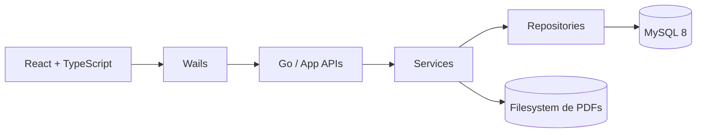
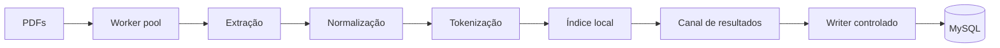

# Arquitetura do Concordia

## Camadas

- **Frontend:** interface, formulários, busca, filtros e métricas.
- **Wails:** ponte entre frontend e Go.
- **APIs Go:** autenticação, artigos, indexação e benchmark.
- **Services:** regras de negócio.
- **Repositories:** acesso ao MySQL.
- **Filesystem:** armazenamento dos PDFs.

## Pipeline de indexação

## Decisão de concorrência

Escritas concorrentes no MySQL causaram deadlocks. A solução foi manter processamento pesado paralelo e serializar a escrita compartilhada por um writer controlado.
