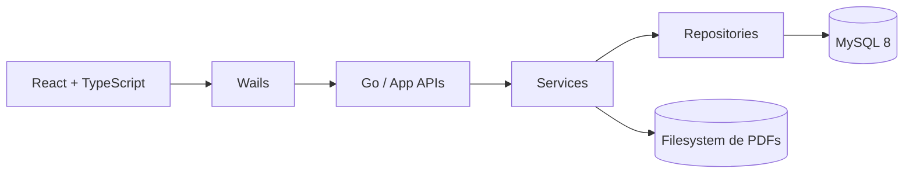
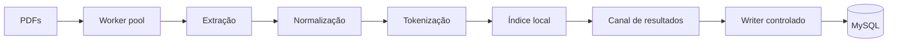

# Arquitetura do Concordia

```mermaid
flowchart LR
    UI[React + TypeScript] --> W[Wails]
    W --> APP[Go / App APIs]
    APP --> S[Services]
    S --> R[Repositories]
    R --> DB[(MySQL 8)]
    S --> FS[(Filesystem de PDFs)]
```

## Camadas

- **Frontend:** interface, formulários, busca, filtros e métricas.
- **Wails:** ponte entre frontend e Go (bindings expostos em `app.go`, `article_api.go` e `indexing_api.go`).
- **APIs Go:** autenticação, artigos, indexação e benchmark.
- **Services:** regras de negócio (`auth_service.go`, `article_service.go`, `indexing_service.go`, `pdf_extractor.go`, `tokenizer.go`, `search_service.go`).
- **Repositories:** acesso ao MySQL (`user_repository.go`, `article_repository.go`, `index_repository.go`, `source_repository.go`).
- **Filesystem:** armazenamento dos PDFs em `storage/articles/` — os arquivos não são salvos como BLOB no banco; o banco guarda apenas `file_path`, metadados e `checksum_sha256`.

## Persistência

Tabelas principais: `users`, `articles`, `article_sources`, `authors`, `article_authors`, `terms`, `term_occurrences`, `article_index_stats` (detalhamento completo em [modelo-relacional.md](../Docs/modelo-relacional.md)).

## Pipeline de indexação

```mermaid
flowchart LR
    A[PDFs] --> B[Worker pool]
    B --> C[Extração]
    C --> D[Normalização]
    D --> E[Tokenização]
    E --> F[Índice local]
    F --> G[Canal de resultados]
    G --> H[Writer controlado]
    H --> I[(MySQL)]
```

O número de workers (goroutines) é configurável pelo Curador ao disparar a indexação (`StartIndexing`). Cada worker processa um subconjunto dos artigos pendentes (extração, normalização, tokenização) de forma independente; os resultados são enviados por um canal para um único "writer" controlado, que persiste os termos e ocorrências no MySQL.

## Decisão de concorrência

Escritas concorrentes no MySQL causaram deadlocks. A solução foi manter processamento pesado paralelo (workers) e serializar a escrita compartilhada por um writer controlado — ou seja, o paralelismo fica na etapa de CPU (extração/tokenização), não na escrita em banco.

## Busca (BM25)

A busca usa os postings do índice invertido (`term_occurrences`) e os comprimentos de documento persistidos em `article_index_stats`. Parâmetros usados: `k1 = 1.2`, `b = 0.75`. Também há suporte a busca aproximada (fuzzy) para tolerância a erro de digitação. Os resultados são ordenados por score decrescente.

## Perfis de acesso

### PESQUISADOR
- login;
- pesquisa (exata e aproximada);
- filtros;
- visualização de resultados e detalhes.

### CURADOR
Além das funções do Pesquisador:
- importação de PDFs (individual e em lote);
- edição/exclusão de artigos;
- disparo da indexação, com escolha do número de workers;
- métricas de indexação e benchmark.

As permissões são verificadas no backend Go (`requireCurator()`, em `app.go`), aplicado em todas as rotas de curadoria (`ImportArticle`, `ImportPDFBatch`, `UpdateArticle`, `DeleteArticle`, `StartIndexing`, `RunIndexingBenchmark`) — não dependem apenas de esconder botões no frontend.

## Integração com o componente computacional avançado (paralelismo)

O componente de computação paralela do projeto **é** a etapa de indexação: ao disparar `StartIndexing`, o `IndexingService` distribui os artigos pendentes entre N goroutines (workers), cada uma extraindo texto do PDF, normalizando e tokenizando de forma independente; os resultados parciais convergem para um único writer, que persiste o índice invertido (`terms` + `term_occurrences`) e as estatísticas (`article_index_stats`) no MySQL. O ganho é medido comparando o tempo de processamento com diferentes números de workers:

| Workers | Processamento | Speedup | Eficiência | MySQL | Total |
|---:|---:|---:|---:|---:|---:|
| 1 | 895 ms | 1,00x | 100,0% | 34.046 ms | 34.941 ms |
| 2 | 707 ms | 1,27x | 63,3% | 32.639 ms | 33.346 ms |
| 4 | 440 ms | 2,03x | 50,9% | 30.655 ms | 31.095 ms |
| 8 | 284 ms | 3,15x | 39,4% | 29.614 ms | 29.898 ms |

A etapa paralelizável caiu de 895 ms para 284 ms (speedup de 3,15x com 8 workers); a persistência MySQL permanece como principal gargalo do tempo fim-a-fim, já que a escrita é serializada por decisão de projeto (ver "Decisão de concorrência" acima).
