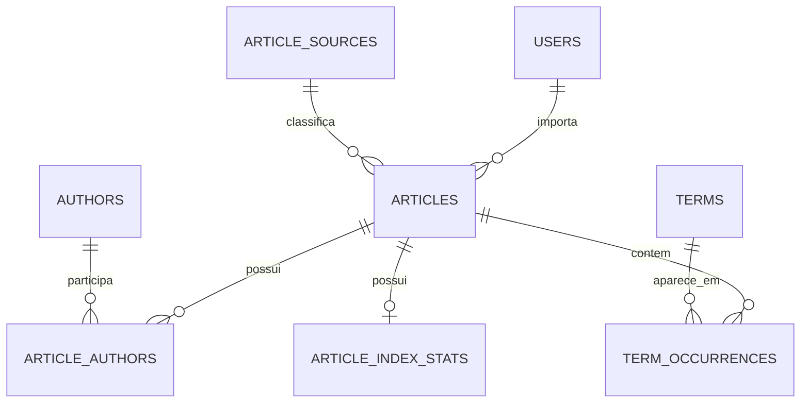
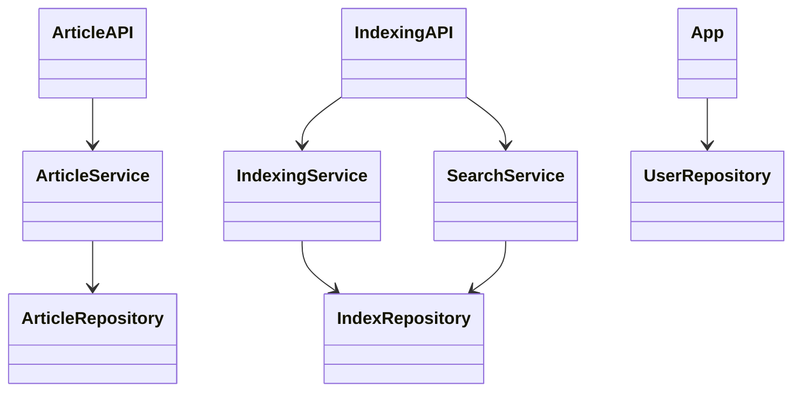

# Diagramas

## MER

```mermaid
erDiagram
    USERS ||--o{ ARTICLES : importa
    ARTICLE_SOURCES ||--o{ ARTICLES : classifica
    ARTICLES ||--o{ ARTICLE_AUTHORS : possui
    AUTHORS ||--o{ ARTICLE_AUTHORS : participa
    ARTICLES ||--o{ TERM_OCCURRENCES : contem
    TERMS ||--o{ TERM_OCCURRENCES : aparece_em
    ARTICLES ||--o| ARTICLE_INDEX_STATS : possui
```

## Componentes/classes principais

```mermaid
classDiagram
    class App
    class ArticleAPI
    class IndexingAPI
    class ArticleService
    class IndexingService
    class SearchService
    class UserRepository
    class ArticleRepository
    class IndexRepository

    App --> UserRepository
    ArticleAPI --> ArticleService
    IndexingAPI --> IndexingService
    IndexingAPI --> SearchService
    ArticleService --> ArticleRepository
    IndexingService --> IndexRepository
    SearchService --> IndexRepository
```
