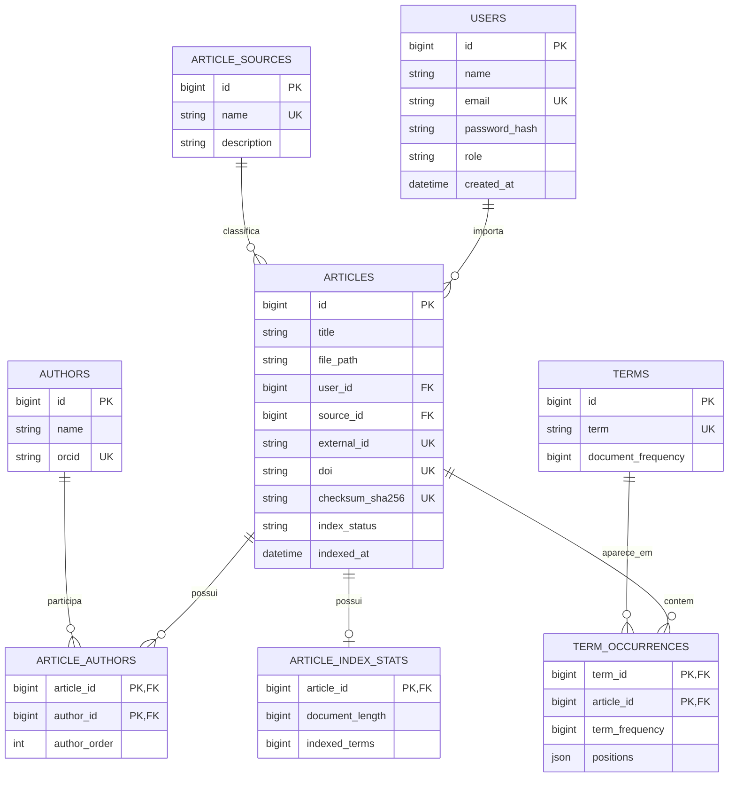
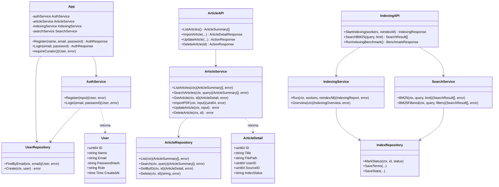

# Diagramas

## MER

```mermaid
erDiagram
    USERS ||--o{ ARTICLES : importa
    ARTICLE_SOURCES ||--o{ ARTICLES : classifica
    ARTICLES ||--o{ ARTICLE_AUTHORS : possui
    AUTHORS ||--o{ ARTICLE_AUTHORS : participa
    ARTICLES ||--o{ TERM_OCCURRENCES : contem
    TERMS ||--o{ TERM_OCCURRENCES : aparece_em
    ARTICLES ||--o| ARTICLE_INDEX_STATS : possui

    USERS {
        bigint id PK
        string name
        string email UK
        string password_hash
        string role
        datetime created_at
    }
    ARTICLE_SOURCES {
        bigint id PK
        string name UK
        string description
    }
    ARTICLES {
        bigint id PK
        string title
        string file_path
        bigint user_id FK
        bigint source_id FK
        string external_id UK
        string doi UK
        string checksum_sha256 UK
        string index_status
        datetime indexed_at
    }
    AUTHORS {
        bigint id PK
        string name
        string orcid UK
    }
    ARTICLE_AUTHORS {
        bigint article_id PK, FK
        bigint author_id PK, FK
        int author_order
    }
    TERMS {
        bigint id PK
        string term UK
        bigint document_frequency
    }
    TERM_OCCURRENCES {
        bigint term_id PK, FK
        bigint article_id PK, FK
        bigint term_frequency
        json positions
    }
    ARTICLE_INDEX_STATS {
        bigint article_id PK, FK
        bigint document_length
        bigint indexed_terms
    }
```

*(atributos completos, com tipos e observações, em [modelo-relacional.md](./modelo-relacional.md))*

## Componentes/classes principais

```mermaid
classDiagram
    class User {
        +uint64 ID
        +string Name
        +string Email
        -string PasswordHash
        +string Role
        +time.Time CreatedAt
    }
    class ArticleDetail {
        +uint64 ID
        +string Title
        +string FilePath
        +uint64 UserID
        +uint64 SourceID
        +string IndexStatus
    }
    class App {
        -authService AuthService
        -articleService ArticleService
        -indexingService IndexingService
        -searchService SearchService
        +Register(name, email, password) AuthResponse
        +Login(email, password) AuthResponse
        +requireCurator() (User, error)
    }
    class ArticleAPI {
        +ListArticles() ArticleSummary[]
        +ImportArticle(...) ArticleDetailResponse
        +UpdateArticle(...) ActionResponse
        +DeleteArticle(id) ActionResponse
    }
    class IndexingAPI {
        +StartIndexing(workers, reindexAll) IndexingResponse
        +SearchBM25(query, limit) SearchResult[]
        +RunIndexingBenchmark() BenchmarkResponse
    }
    class AuthService {
        +Register(input) (User, error)
        +Login(email, password) (User, error)
    }
    class ArticleService {
        +ListArticles(ctx) (ArticleSummary[], error)
        +SearchArticles(ctx, query) (ArticleSummary[], error)
        +GetArticle(ctx, id) (ArticleDetail, error)
        +ImportPDF(ctx, input) (uint64, error)
        +UpdateArticle(ctx, input) error
        +DeleteArticle(ctx, id) error
    }
    class IndexingService {
        +Run(ctx, workers, reindexAll) (IndexingReport, error)
        +Overview(ctx) (IndexingOverview, error)
    }
    class SearchService {
        +BM25(ctx, query, limit) (SearchResult[], error)
        +BM25Filtered(ctx, query, filters) (SearchResult[], error)
    }
    class UserRepository {
        +FindByEmail(ctx, email) (User, error)
        +Create(ctx, user) error
    }
    class ArticleRepository {
        +List(ctx) (ArticleSummary[], error)
        +Search(ctx, query) (ArticleSummary[], error)
        +GetByID(ctx, id) (ArticleDetail, error)
        +Delete(ctx, id) (string, error)
    }
    class IndexRepository {
        +MarkStatus(ctx, id, status)
        +SaveTerms(...)
        +SaveStats(...)
    }

    App --> AuthService
    App --> UserRepository
    ArticleAPI --> ArticleService
    IndexingAPI --> IndexingService
    IndexingAPI --> SearchService
    AuthService --> UserRepository
    ArticleService --> ArticleRepository
    IndexingService --> IndexRepository
    SearchService --> IndexRepository
    ArticleService ..> ArticleDetail : retorna
    AuthService ..> User : retorna
```

